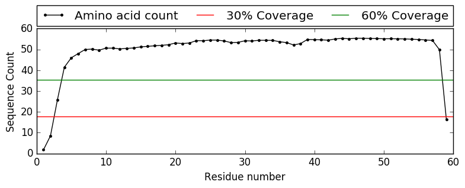

.. _example_analyse_msa:

Analysing a Multiple Sequence Alignment
---------------------------------------

.. warning::
   You require the `Matplotlib <http://matplotlib.org/>`_ and `SciPy <http://scipy.org/>`_ packages to use this script. If you are unsure if it is installed on your system, refer to the :ref:`installation` documentation

Using a script
^^^^^^^^^^^^^^

If you would like to analyse a Multiple Sequence Alignment (MSA) file, you can do so using ConKit's provided script, which is called ``conkit.msatool``.

.. code-block:: bash

   $> conkit.msatool toxd/toxd.a3m a3m

The call above analyses the ``toxd.a3m`` MSA file, which is in ``a3m`` format. This call with will procude the following output:

.. code-block:: none

   Input MSA File:                   toxd/toxd.a3m
   Input MSA Format:                 a3m
   Sequence Identity Threshold:      0.7
   Length of the Target Sequence:    59
   Total Number of Sequences:        13448
   Number of Effective Sequences:    3318
   Sequence Coverage Plot:           toxd/toxd.png

The output tells you the file and format you have provided. It also prints which identity threshold was used to compare sequences during the analysis. Furthermore, it tells you the total number of sequences in your alignment and the number of effective sequences, or depth, of your alignment. Finally, this script will produce a plot that illustrates the coverage of your alignment in individual positions. The plot is shown below:

.. _Toxd Frequence Plot:

--------------------------------------------------------

Using Python
^^^^^^^^^^^^

In order to obtain the same information using the Python interface, use the following commands.

1. The MSA ConKit hierarchy needs to be created first.

.. code-block:: python

   >>> msa = conkit.io.read('toxd/toxd.a3m', 'a3m')

2. To obtain the length of the target sequence, you can simply ask the ``msa`` hierarchy for it.

.. code-block:: python

   >>> print('Length of the Target Sequence: %d' % msa.top_sequence.seq_len)
   59

This tells you the first sequence in the alignment has 59 residues, i.e. the chain length of your target.

3. We can again use the ``msa`` hierarchy to figure out the total number of sequences.

.. code-block:: python

   >>> print('Total number of sequences: %d' % msa.nseqs)
   Total number of sequences: 13488

4. ... and the number of effective sequences in the alignment at 70% identity cutoff.

.. code-block:: python

   >>> n_eff = msa.calculate_meff(identity=0.7)
   >>> print('Number of Effective Sequences: %d' % n_eff)
   Number of Effective Sequences: 3318

5. We can also plot the amino acid frequency at each position in the alignment.

.. code-block:: python

   >>> file_name = 'toxd/toxd.png'
   >>> msa.plot_freq(file_name=file_name)

This will this `Toxd Frequence Plot`_, identical to the one from the script.