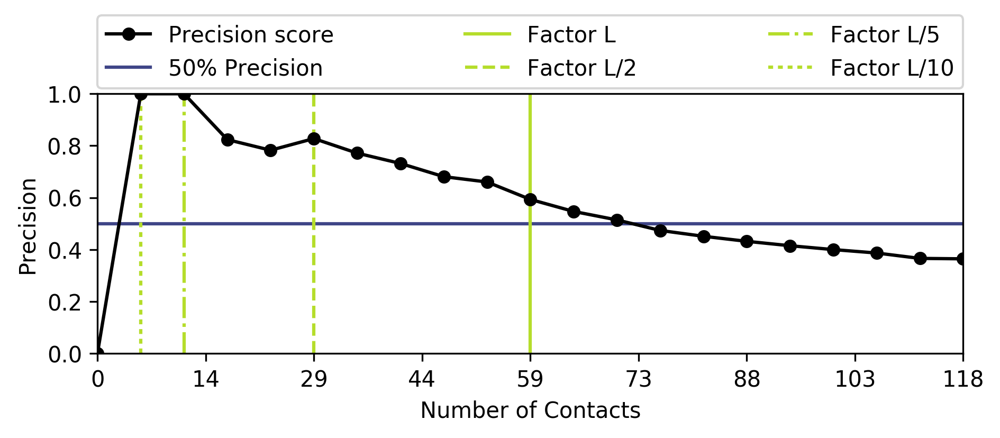

Contact Prediction Analysis
---------------------------

1. **Let's create the contact prediction hierarchy in ConKit**

.. code-block:: python

   >>> import conkit
   >>> conpred = conkit.io.read("toxd/toxd.mat", "ccmpred").top_map
   >>> conpred.sequence = conkit.io.read("toxd/toxd.fasta", "fasta").top_sequence
   >>> conpred.assign_sequence_register()

Note, we've chosen the top contact map immediately because this file only contained a single one. We also added the sequence straight away and assigned the sequence register using the :func:`assign_sequence_register() <conkit.core.ContactMap.assign_sequence_register>` function. The latter makes sure that each residue number has the right amino acid assigned.

2. **Plotting a contact map**

Similar to the example on plotting a contact map, this is something you will almost certainly do every single time you obtain a contact prediction. Head over to the :ref:`example_plotting_a_map` in case you haven't looked at it.

Let's assume we have created the following contact map plot

.. image:: ../images/toxd_cmap_simple.png
   :alt: Toxd CMap Simple
   :scale: 30
   :align: center

Looking at this contact map tells us that there is most likely a |beta|-strand between residues 13-23 and 33-34. The spread of the contacts also gives us an indication that we are dealing with a monomeric protein structure. However, our contact prediction contains a lot more information that is not visible from this plot.

3. **Looking at individual residues**

Assume you have prior knowledge about the protein target, in this case PDB entry `1DTX <http://www.rcsb.org/pdb/explore/explore.do?structureId=1dtx>`_. Let's assume that this prior knowledge includes information about a residue, e.g. residue 34. As a result, we might want to look at all contacts related to residue 34 in our contact map to see specifically if any relevant contacts were predicted.

In ConKit, we can use the :func:`find() <conkit.core.ContactMap.find>` function to extract all contacts containing one or more residues.

.. code-block:: python

   >>> residue_34_map = conpred.find([34])
   >>> print(residue_34_map)
   ContactMap(id="map_1", ncontacts=59)

This print statement in the last line indicates that there a total of 59 contacts are associated with residue 34. Let's rank them to see the most confidently predicted contact involving residue 34.

We use the :func:`sort() <conkit.core.ContactMap.sort>` function for ranking our map. We want to sort it by the ``raw_score`` in reverse order, i.e. largest values at the top of the list. We don't want to create a new contact map but instead apply the changes to the existing one, thus we use the ``inplace=True`` keyword argument.

.. code-block:: python

   >>> residue_34_map.sort("raw_score", reverse=True, inplace=True)
   >>> print(residue_34_map[0])
   Contact(id="(21, 34)" res1="P" res1_chain="" res1_seq=21 res2="R" res2_chain="" res2_seq=34 raw_score=0.459334760904)

This shows that the most confidently predicted contact is between residues 21 and 34 with a prediction score of 0.46. Considering our contact map from the step 2, this information would make sense as we assumed |beta|-sheet in that region of residues.

4. **Calculating the precision score**

.. note::

   You can use the ``conkit-precision`` script to achieve the same goal.

Finally, in some cases you either have already existing structural information, such as a crystal structure, or a predicted model and you want to assess how accurate or satisfied your contact prediction is. For this kind of analysis, the precision score is the ideal measure. It compares one set of contacts against a second and calculates the ratio between the matches and the total number of contacts compared.

In ConKit, this functionality is provided via the :attr:`precision <conkit.core.ContactMap.precision>` attribute of each contact map. If we want to use the latter, we need to :func:`match() <conkit.core.ContactMap.match>` the two contact maps first. The following Python code shows the entire process.

.. code-block:: python

   >>> pdb = conkit.io.read("toxd/toxd.pdb", "pdb").top_map
   >>> conpred.remove_neighbors(inplace=True)
   >>> conpred.sort("raw_score", reverse=True, inplace=True)
   >>> conpred.match(pdb, inplace=True)
   >>> print(conpred[:59].precision)
   0.59322033898305082

The output from this final ``print`` statement tells us that the precision score for the 59 most confidently predicted contacts is 0.59.

We could also ask for the first 30 contacts only or the last 20. Each contact map understands Python slices, and thus any fraction can be successfully extracted.

.. code-block:: python

   >>> # Calculate the precision scores for various L threshold contacts
   >>> for factor in (0.5, 1.0, 1.5):
   ...     ncontacts = int(conpred.sequence.seq_len * factor)
   ...     precision = conpred[:ncontacts].precision
   ...     print("Ncontacts %d at factor %.1f ==> precision score %.3f" % (ncontacts, factor, precision))
   Ncontacts 29 at factor 0.5 ==> precision score 0.828
   Ncontacts 59 at factor 1.0 ==> precision score 0.593
   Ncontacts 88 at factor 1.5 ==> precision score 0.432

As you can see, it's simple to calculate late it for the three different factors ``0.5``, ``1.0`` and ``1.5``, i.e. ``L/2``, ``L`` and ``3L/2``.

If you would like to automate this process, or rather visualise the data, you can use the `PrecisionEvaluationFigure <conkit.plot.PrecisionEvaluationPlot.PrecisionEvaluationFigure>` class. It accepts a **matched** contact map and calculates the precision values at different thresholds to produce a plot.

To produce a precision evaluation plot with factors between 0.0 and 5.0 with a stepwise increase of 0.1, use the following command.

.. code-block:: python

   >>> conkit.plot.PrecisionEvaluationFigure(conpred, min_cutoff=0.0, max_cutoff=5.0, cutoff_step=0.1)

.. note::

   You can also generate the final plot using the ``conkit-plot`` script.

.. |beta| unicode:: u03B2
