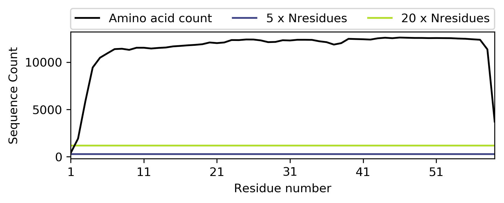

Sequence Coverage Plotting
--------------------------

.. code-block:: python

   >>> msa = conkit.io.read('toxd/toxd.a3m', 'a3m')
   >>> conkit.plot.SequenceCoverageFigure(msa)

The following plot will be produced. Your alignment coverage is shown with the black line with each point corresponding to a residue in the alignment. The other two lines give you indicators of how good your alignment is.

If parts or all of your coverage fall below the "5 x Nresidues" line, the suitability for covariance-based contact prediction is very low. If most residues in the alignment are well above the "5 x Nresidues" line, possibly even the "20 x Nresidues", and bigger chunks are below, then you might want to consider re-defining your sequence boundaries to predict contacts only for the well-covered area.

If most residues in your alignment have a better coverage than the "20 x Nresidues" line, the alignment is well-suited for covariance-based predictions.

