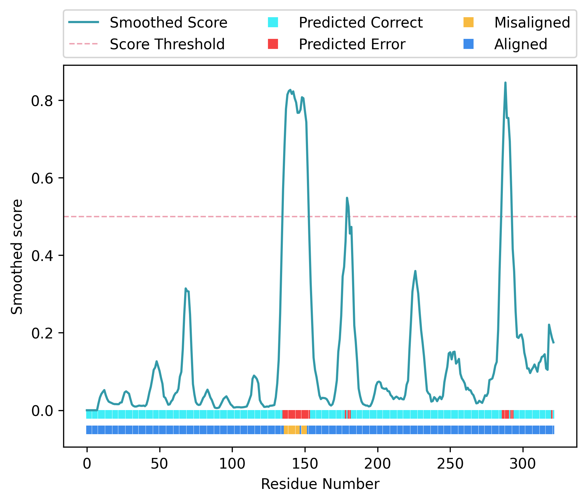

.. _script_model_validation:

Model validation
--------------------

Conkit can be used to perform model validation using inter-residue distance predictions. This can be used to detect sequence register errors and other kinds of modelling errors in the protein model. To be able to use this functionality, you must ensure that you install first mkdssp and map_align

.. code-block:: bash

   $> conkit-validate 7l6q/7l6q.fasta fasta 7l6q/7l6q.af2 alphafold2 7l6q/7l6q_B.pdb alphafold2 pdb -dssp_exe /usr/bin/mkdssp --map_align_exe /usr/bin/map_align -output 7l6q/7l6q.png

The call above uses the AlphaFold 2 distance prediction file ``7l6q.af2`` file, which is in ``alphafold2`` format, and compares the predicted inter-residue distances with those observed in the protein model at ``7l6q_B.pdb``. Note that you need to provide a path to the executables of ``dssp` and ``map_align`` using the keywords ``-dssp_exe`` and ``--map_align_exe`` respectively. This command will create the file ``7l6q.png`` with the following figure:

In this representation, scores predicted by a trained SVM classifier are shown as a turquoise line, and they have been smoothed using a five residue rolling average. The higher this score, the more likely it is that a given residue is part of a modelling error. A red dotted line shows the 0.5 score threshold, and a top horizontal bar at the bottom of the figure shows for each residue position whether the predicted score was above 0.5 (red) or below (cyan). The lower horizontal bar at the bottom of the figure shows for each residue position whether the CMO was achieved using the sequence register observed in the model (dark blue) or an alternative register (yellow). The same information will also be printed into the terminal in the form of a table, which will contain the predicted SVM score and the CMO results at each residue position.
If you want to know more about ``conkit-validate`` you may want to `watch our video at the CCP4 SW 2022 <https://www.youtube.com/watch?v=rG_WoUhdnLU&t=565s>`_
