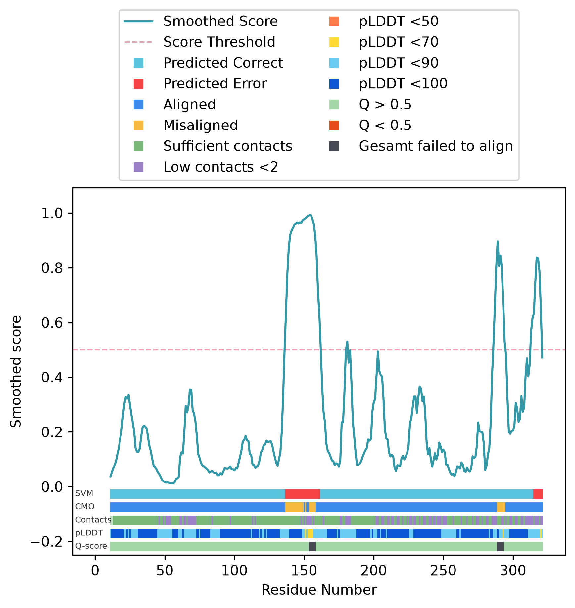
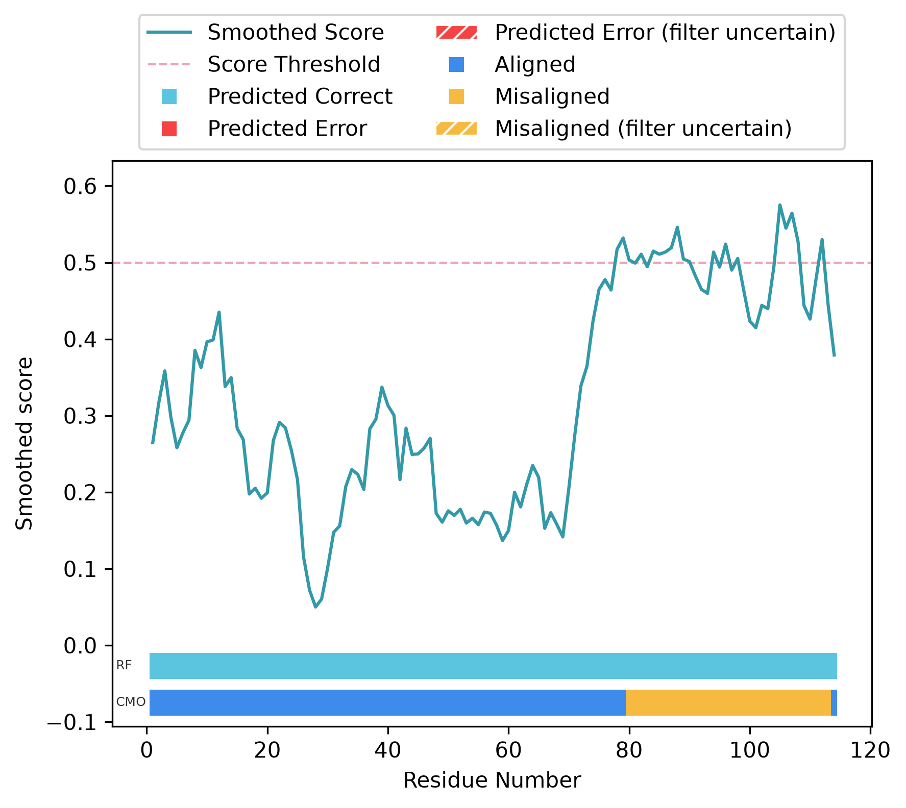

.. _script_model_validation:

Model validation
--------------------

ConKit can be used to perform model validation using inter-residue distance predictions. This can be used to detect sequence register errors and other kinds of modelling errors in a protein or RNA model.

Basic usage
^^^^^^^^^^^^^

.. code-block:: bash

   $> conkit-validate 7l6q/7l6q.fasta fasta 7l6q/fold_7l6q_model_0.cif mmcif 7l6q/7l6q_B.pdb pdb \
          --map_align_exe /usr/bin/map_align \
          --dssp_exe /usr/bin/mkdssp \
          --gesamt_exe /usr/bin/gesamt \
          --run_svm yes \
          --output 7l6q/7l6q.png

The positional arguments are, in order: the sequence file and its format, the distance prediction file and its format, and the structure file and its format. Here the prediction is an AlphaFold2 predicted structure in mmCIF format. The ``--map_align_exe``, ``--dssp_exe``, and ``--gesamt_exe`` flags provide paths to the required external executables (see :ref:`installation`). The ``--run_svm yes`` flag forces the classifier to run even when the input is a structure file (by default the classifier only runs with a distogram).

This command will create the file ``7l6q.png``:

The output figure shows a smoothed classifier score for each residue position (turquoise line; higher score = more likely to be a modelling error), with a pink dashed line at the 0.5 threshold. Below the score curve, labelled annotation bars are drawn for each active feature:

- **SVM bar** — cyan if the residue was predicted correct, red if predicted as a potential error
- **CMO bar** — dark blue if the contact-map alignment placed the model at the correct register, amber if map_align preferred an alternative register
- **Contacts bar** — green if the residue has sufficient contacts in the prediction, purple if it has too few (potential false-positive indicator)
- **pLDDT bar** — AlphaFold confidence tier for each residue using the standard AlphaFold colour scheme; low-confidence residues are more likely to produce false-positive error calls
- **Q-score bar** — local GESAMT Q-score between the prediction and the model in flagged regions; light green if Q > 0.5 (structures agree locally, error may be a false positive), deep orange if Q < 0.5 (structures differ, error signal is stronger)

The same information is also printed to the terminal as a table.

If you want to know more about ``conkit-validate`` you may want to `watch our video at the CCP4 SW 2022 <https://www.youtube.com/watch?v=rG_WoUhdnLU>`_

RNA model validation
^^^^^^^^^^^^^^^^^^^^^

For RNA, use ``--moltype RNA``. The tool will use C1′ inter-nucleotide distances and switch to RNA-specific classifiers (Random Forest) automatically.

.. code-block:: bash

   $> conkit-validate 4wce/4wce_Y.fasta fasta 4wce/alphafold3_4wce_Y_model.cif mmcif \
          4wce/4wce_Y.pdb pdb \
          --moltype RNA \
          --map_align_exe /usr/bin/map_align \
          --gesamt_exe /usr/bin/gesamt \
          --areaimol_exe /usr/bin/areaimol \
          --gemmi_exe /usr/bin/gemmi \
          --run_svm yes \
          --output 4wce/4wce_Y.png

This command validates the experimental chain Y structure of PDB entry 4WCE against an AlphaFold 3 predicted structural model. The predicted model is used both as the contact-map reference and as the target for GESAMT structural alignment. The output figure ``4wce_Y.png`` is shown below:

For RNA the figure shows two labelled bars: the **RF bar** (Random Forest classifier) and the **CMO bar** (contact-map alignment). When the combined filter has sufficient data (pLDDT + contact count + GESAMT Q-score all available), individual filter bars are collapsed into a hatched overlay directly on the RF and CMO bars: a hatched pattern on an error or misaligned residue indicates the filter is uncertain whether that call is a true error or a false positive.

.. note::

   Modified nucleotides present as HETATM records (e.g. pseudouridine PSU, N2-methylguanosine M2G) are handled automatically when reading the structure.

Optional flags
^^^^^^^^^^^^^^^

Control which validation steps run:

``--run_svm yes|no``
  Run the classifier (SVM/RF) validation step. Default: ``yes`` when the prediction is a distogram; ``no`` when it is a structure file.

``--run_map_align yes|no``
  Run the CMO (map_align) contact-map alignment step. Default: ``yes``.

``--run_filters yes|no``
  Run false-positive indicator filters where data is available. Default: ``yes``.

Control how errors are called:

``--svm_threshold FLOAT``
  Classifier probability threshold above which a residue is considered a potential error. Default: ``0.5``.

``--min_error_length INT``
  Minimum number of consecutive residues that must exceed the threshold before a region is flagged. Default: ``6``.

Filter thresholds (for the false-positive bars):

``--cmo_filter FLOAT``
  CMO score threshold below which a residue is considered a potential false positive. Default: ``0.54``.

``--rf_filter FLOAT``
  RF filter score threshold. Default: ``0.76``.

External executables:

``--map_align_exe PATH``
  Path to the ``map_align`` executable (required for CMO step).

``--dssp_exe PATH``
  Path to the ``mkdssp`` executable (required for protein secondary-structure features; only required when running the SVM classifier).

``--gesamt_exe PATH``
  Path to the ``gesamt`` executable (for Q-score false-positive indicators).

``--areaimol_exe PATH``
  Path to the ``areaimol`` executable (for solvent-accessibility features; RNA only).

``--gemmi_exe PATH``
  Path to the ``gemmi`` executable (required by areaimol when the input is an mmCIF file).

``--dnatco_exe PATH``
  Path to the DNATCO node executable (optional RNA secondary-structure annotation; provides a marginal improvement for the RNA Random Forest classifier).

Custom contact definitions:

``--contact_dist FLOAT``
  Distance cutoff in Ångstrom for contacts when using ``--moltype Custom``.

``--rep_atom ATOM``
  Representative atom name for contacts when using ``--moltype Custom`` (e.g. ``CA``, ``C1'``).

Other options:

``--renumber_model yes|no``
  Create a renumbered copy of the input model with residue numbers matching the sequence before validation. Default: ``yes``.

``--chain CHAIN``
  Chain identifier to extract from the structure file. Default: first chain.

``--confidence_file PATH`` / ``--confidence_file_type FORMAT``
  External file supplying per-residue pLDDT or other confidence scores (if not already present in the distance prediction file).

``--take_plddt_from_distance_prediction yes|no``
  Whether to read pLDDT values from the distance prediction file (e.g. from B-factor column of a PDB/mmCIF). Default: ``yes``.

``--output PATH``
  Output figure file. Default: ``conkit.png``.

``--output_json PATH``
  Write per-residue validation results to a JSON file.

``--outdir PATH``
  Write intermediate contact maps to this directory for debugging.
