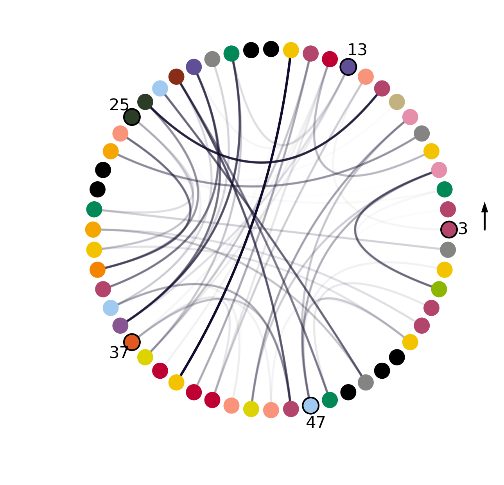

Contact Map Chord Diagram Plotting
----------------------------------

If you would like to plot a contact map in Chord diagram style using ConKit without the overhead of using Python, you can simply use the ``conkit-plot`` script.

.. code-block:: bash

   $> conkit-plot chord toxd/toxd.fasta fasta toxd/toxd.mat ccmpred

The call above uses the contact prediction file ``toxd.mat`` file, which is in ``ccmpred`` format, and plots the following contact map stored in the file ``toxd/toxd.png``.

Each residue in the Chord plot corresponds to an amino acid in your sequence. For a full list of the encoding used, check the :obj:`ContactMapChordFigure <conkit.plot.ContactMapChordPlot.ContactMapChordFigure>`.

.. role:: ala
.. role:: cys
.. role:: asp
.. role:: glu
.. role:: phe
.. role:: gly
.. role:: his
.. role:: ile
.. role:: lys
.. role:: leu
.. role:: met
.. role:: asn
.. role:: pro
.. role:: gln
.. role:: arg
.. role:: ser
.. role:: thr
.. role:: val
.. role:: trp
.. role:: tyr
.. role:: unk

The color coding of the full sequence used is the following:

:gln:`Q` :pro:`P` :arg:`R` :arg:`R` :lys:`K` :leu:`L` :cys:`C` :ile:`I` :leu:`L` :his:`H` :arg:`R` :asn:`N` :pro:`P` :gly:`G` :arg:`R` :cys:`C` :thr:`T` :tyr:`Y` :asp:`D` :lys:`K` :ile:`I` :pro:`P` :ala:`A` :phe:`F` :tyr:`Y` :tyr:`Y` :asn:`N` :gln:`Q` :lys:`K` :lys:`K` :lys:`K` Q :cys:`C` :glu:`E` :arg:`R` :phe:`F` :asp:`D` :trp:`W` :ser:`S` :gly:`G` :cys:`C` :gly:`G` :gly:`G` :asn:`N` :ser:`S` :asn:`N` :arg:`R` :phe:`F` :lys:`K` :thr:`T` :ile:`I` :glu:`E` :glu:`E` :cys:`C` :arg:`R` :arg:`R` :thr:`T` :cys:`C` :ile:`I` :gly:`G`
