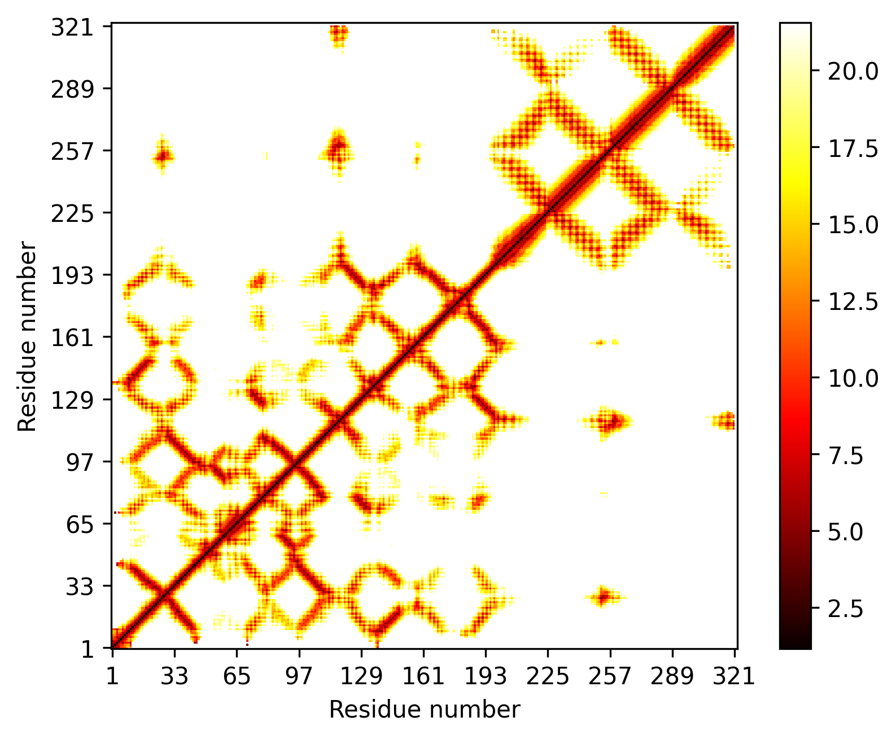

.. _script_plot_distogram:

Distogram Plotting
--------------------

If you would like to plot a distogram using ConKit without the overhead of using Python, you can simply use the ``conkit-plot`` script.

.. code-block:: bash

   $> conkit-plot distheat -o 7l6q/7l6q.png 7l6q/7l6q.fasta fasta 7l6q/7l6q.af2 alphafold2

The call above uses the AlphaFold 2 distance prediction file ``7l6q.af2`` file, which is in ``alphafold2`` format, and plots the following distogram stored in the file ``7l6q/7l6q.png``

--------------------------------------------------------------
