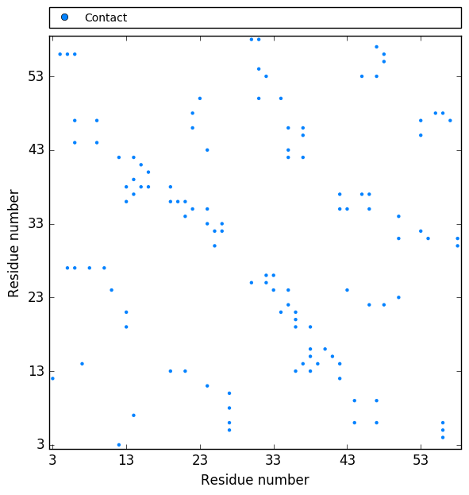
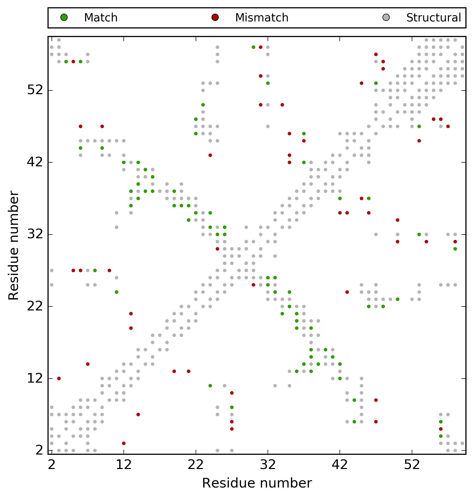
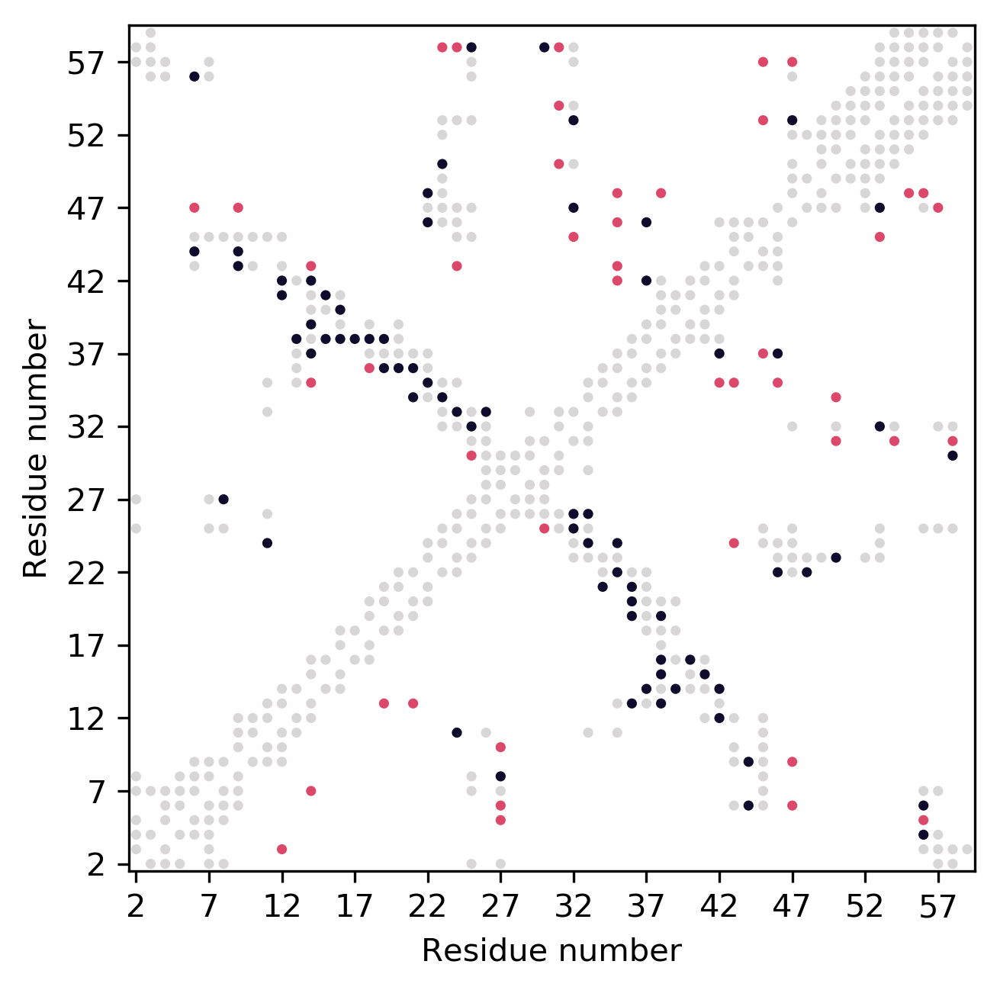
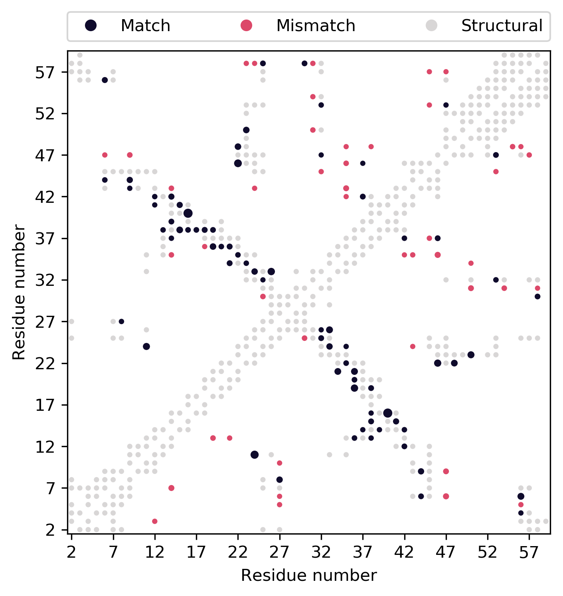

.. _example_plotting_a_map:

Contact Map Plotting
--------------------

If you would like to plot a contact map using ConKit without the overhead of using Python, you can simply use the ``conkit-plot`` script.

.. code-block:: bash

   $> conkit-plot cmap toxd/toxd.fasta fasta toxd/toxd.mat ccmpred

The call above uses the contact prediction file ``toxd.mat`` file, which is in ``ccmpred`` format, and plots the following 2D contact map stored in the file ``toxd/toxd.png``

--------------------------------------------------------------

You can also add a reference structure to determine which contacts are true and false positive contacts. By default, all contacts are identified in the reference structure by measuring the distance between Cβ atoms, whereby all atoms closer than 8Å are considered to be in contact.

.. code-block:: bash

   $> conkit-plot cmap -p toxd/toxd.pdb toxd/toxd.fasta fasta toxd/toxd.mat ccmpred

The call above produces a contact map plot looking like this. The gray points are the reference contacts, and matched and mismatched contacts are shown in color.

--------------------------------------------------------------

You could also add a second contact prediction file to the call to compare two maps against each other.

.. code-block:: bash

   $> conkit-plot cmap -e toxd/toxd.psicov -ef psicov -p toxd/toxd.pdb toxd/toxd.fasta fasta toxd/toxd.mat ccmpred

The call above produces a contact map plot looking like this. The gray points are the reference contacts, and matched and mismatched contacts are shown in color. The top triangle is the second contact map from file ``toxd/toxd.psicov`` whereas the bottom one is from ``toxd/toxd.mat``.

--------------------------------------------------------------

Finally, you could also illustrate the confidence with which each contact was predicted.

.. code-block:: bash

   $> conkit-plot cmap --confidence -e toxd/toxd.psicov -ef psicov -p toxd/toxd.pdb toxd/toxd.fasta fasta toxd/toxd.mat ccmpred

The call above produces a contact map plot looking like this. All parameters and settings are identical to the previous map except the ``--confidence`` flag, which will show more confidently predicted contacts as larger markers.

.. note::

   You can use the last two examples also **without** a reference structure!
