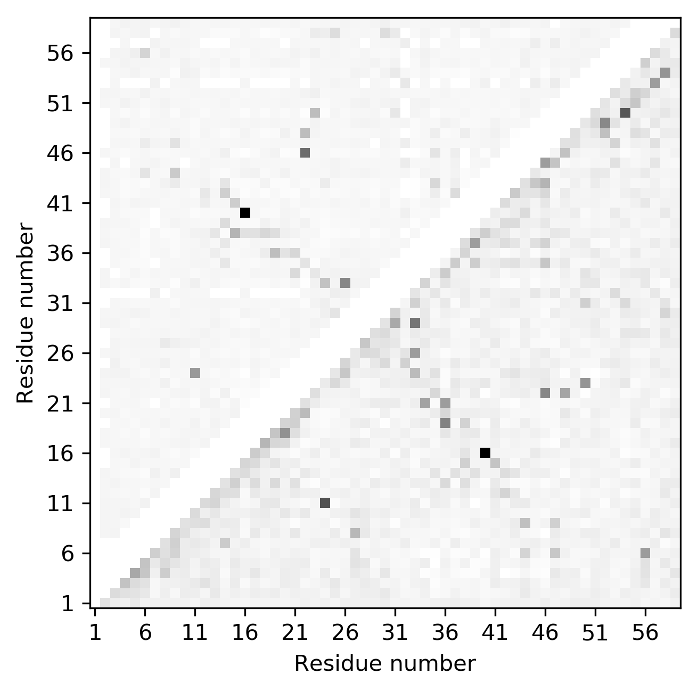

.. _script_plot_mat:

Contact Map Matrix Plotting
---------------------------

If you would like to plot a contact map using ConKit without the overhead of using Python, you can simply use the ``conkit-plot`` script.

.. code-block:: bash

   $> conkit-plot cmat toxd/toxd.fasta fasta toxd/toxd.mat ccmpred

The call above uses the contact prediction file ``toxd.mat`` file, which is in ``ccmpred`` format, and plots the following 2D contact map matrix stored in the file ``toxd/toxd.png``

.. figure:: ../images/toxd_cmat_simple.png
   :alt: Toxd CMat Simple
   :align: center
   :scale: 30

--------------------------------------------------------------

You could also add a second contact prediction file to the call to compare two maps against each other.

.. code-block:: bash

   $> conkit-plot cmat -e toxd/toxd.psicov -ef psicov toxd/toxd.fasta fasta toxd/toxd.mat ccmpred

The call above produces a contact map plot looking like this. The gray points are the reference contacts, and matched and mismatched contacts are shown in color. The top triangle is the second contact map from file ``toxd/toxd.psicov`` whereas the bottom one is from ``toxd/toxd.mat``.

