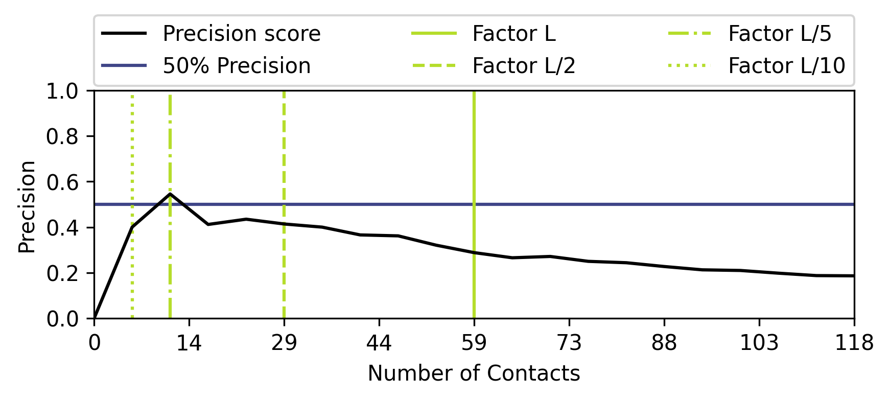

.. _script_plot_peval:

Precision Evaluation Plotting
-----------------------------

The ``peval`` subcommand of the ``conkit-plot`` script is used to plot the precision evaluation plot of the contact prediction file **when compared against a second contact prediction or structure**.

.. code-block:: bash

   $> conkit-plot peval -j 0.1 -min 0 -max 2.0 toxd/toxd.pdb pdb toxd/toxd.fasta fasta toxd/toxd.mat ccmpred

Three command line flags above are important to note. The ``-min`` flag is the minimum factor for contact selection, i.e. ``L * min`` number of contacts. The ``-max`` flag is the maximum factor for contact selection, i.e. ``L * max`` number of contacts. The ``-j`` flag defines the stepwise increase inbetween ``-min`` and ``-max``.

